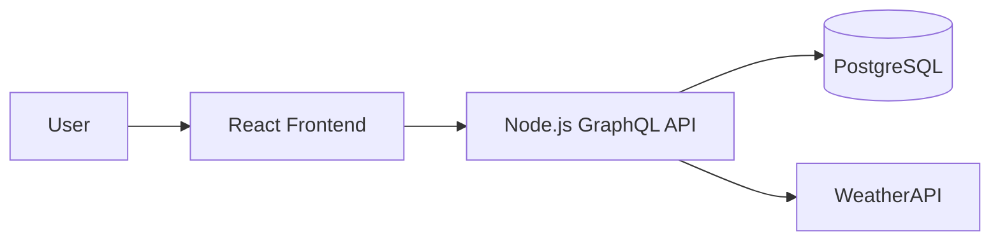

# System Design

## Overview

This project is a full-stack todo app for the Careology technical test.

The system is designed as a simple client-server application with a React frontend, a Node.js GraphQL backend, and a PostgreSQL database.

## Key Decisions

- The frontend will use React, TypeScript, Vite, MUI, Apollo Client, React Hook Form, Zod, and dnd-kit.
- The backend will use Node.js, TypeScript, Apollo Server, GraphQL, Prisma, PostgreSQL, JWT, and bcrypt.
- PostgreSQL is used because users, tasks, tags, due dates, search, and task ordering fit a relational model well.
- Apollo Client is used because the backend exposes a GraphQL API.
- MUI is used to satisfy the component library requirement and speed up accessible UI development.
- Prisma is used to keep database access typed, maintainable, and migration-friendly.
- Docker Compose will be used for local PostgreSQL.
- GitHub Actions will be used for CI.
- Vitest will cover unit and integration tests.
- Playwright will cover browser-level user flows.

## Application Design

Users will register and log in with email and password.

Passwords will be hashed with bcrypt, and authenticated requests will use JWT.

Each user will only be able to access their own tasks.

Tasks will support create, edit, delete, done/undone, due dates, tags, search, and drag and drop ordering.

When a task contains a city name, the backend will use the first detected city to request weather data from WeatherAPI and store the result with the task.

## Local Development

The app will run locally with separate frontend and backend development servers.

PostgreSQL will run through Docker Compose.
